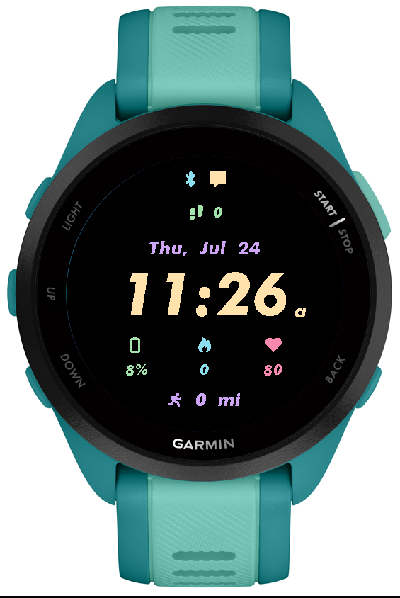
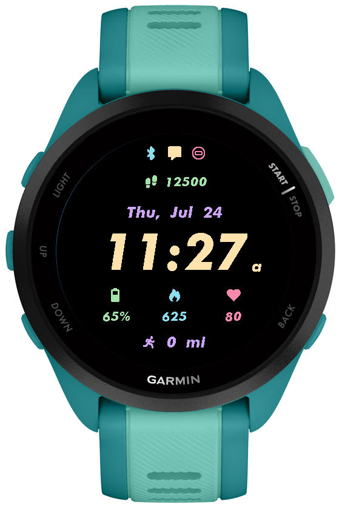
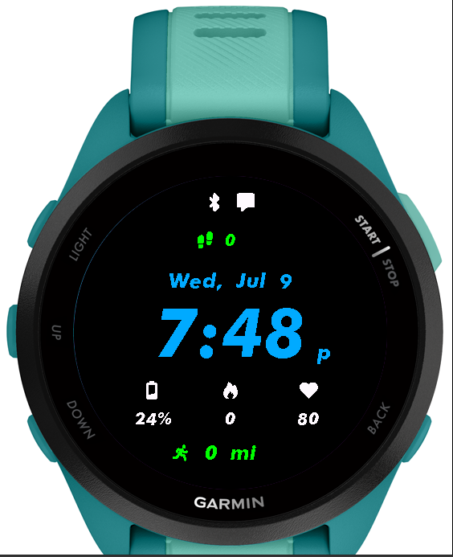
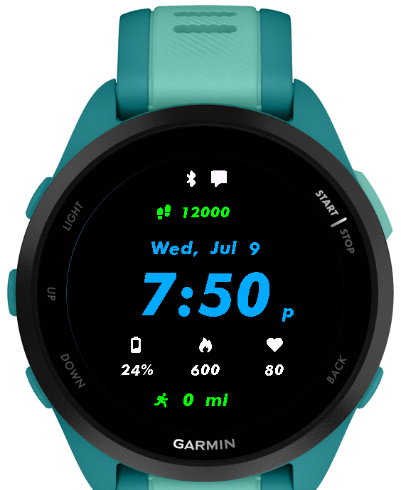

# **Simple Garmin Watchface**

### **Description**
This is my first attempt at building a Garmin Watchface using Monkey C.
My main reason for building this project is to use this watchface on my Garmin Forerunner 165 Music (and I am currently using this watchface). Thus, it has only been tested on the Forerunner 165 Music model. 

       

### **Data Fields**
- *Notifications Indicator*
- *Phone Connection Indicator (Bluetooth)*
- *Current Date*
- *Battery*
- *Calories*
- *Heart Rate*
- *Weekly Running Distance (in miles)*

### **On-Device Settings**
- *Allows color customization for any data field from set color list*
- *Customization can be applied with the on-device watch face customization menu*

        
